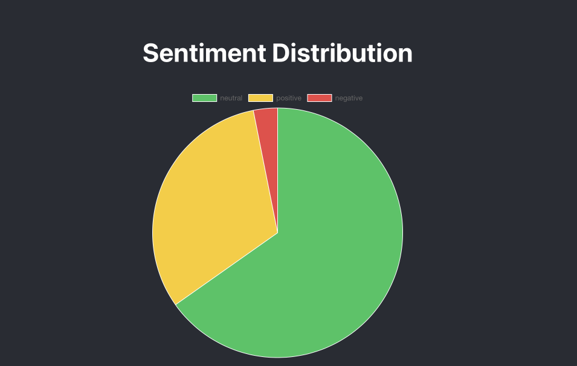
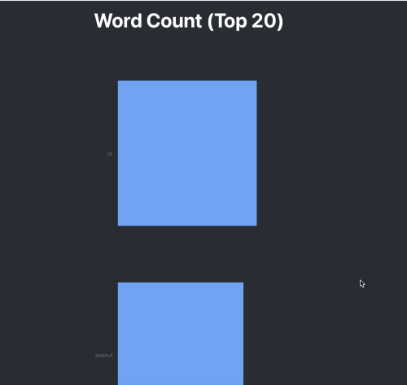
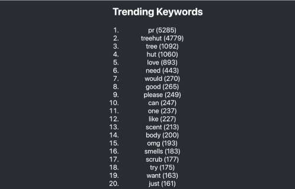
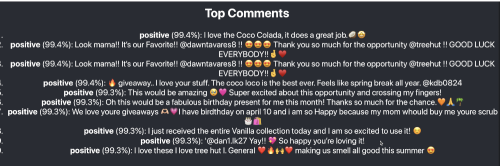
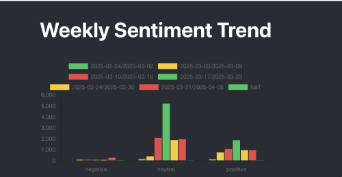

# Project Summary: Instagram Comment Sentiment & Trend Dashboard

## What I Built

I created a simple web app that looks at Instagram comments from Treehut’s account and helps the team understand:

- What people are feeling (positive, neutral, or negative)
- What words and topics are showing up often  
- Which products get good or bad feedback 
- How comment volume and sentiment change over time 

The backend (FastAPI) handles the data and analysis. The frontend (React) shows the results in easy-to-read charts and lists.

---

## Why I Built It This Way

- **Sentiment model**: I used a model trained on social media posts, so it understands how people talk on platforms like Instagram.
- **Weekly trends**: Grouping by week shows how feedback changes over time.
- **Top comments**: Helps the team see real examples of what people are saying.
- **Word cloud and trending words**: Quickly shows what topics or products people talk about most.
- 
This setup gives Treehut both a high-level view and real customer voices.

---

## How to Run It

Please check the [README](/README.md) for instructions on how to run this project.

---

## What Tools and AI I Used

- **Hugging Face**: For sentiment analysis using `twitter-roberta-base-sentiment`
- **Pandas**: For cleaning and organizing the data
- **WindSurf and ChatGPT**: Helped with coding ideas, error fixing, and writing this report
- **React + Chart.js**: To make charts and show the data
- **FastAPI**: To create a fast and simple backend

---

## What I'd Add Next

If I had more time, I’d add:

- **Comment summaries** using AI
- **Trend prediction** (like forecasting future sentiment)
- **Better filters** (like by product line or campaign)
- **Stopwords** (enhance stopword detection)t

---

## Why This is Useful

This tool helps Treehut:

- Understand what people like or dislike
- Track how feedback changes over time
- See which products need attention
- Save time by reading only the most helpful comments

It makes social media feedback easier to understand and take action on.

